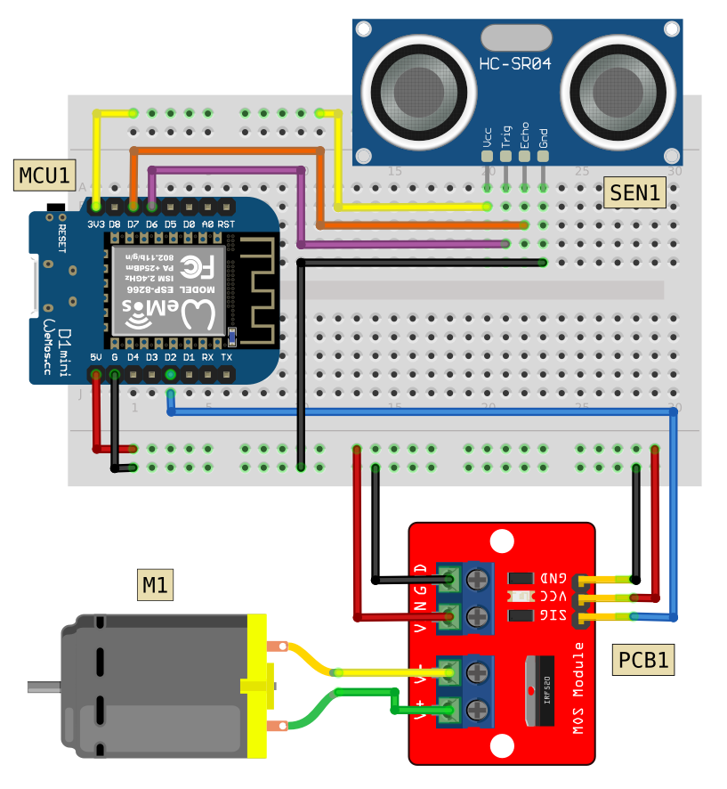

# Automatic Hand Sanitizer

## Breadboard Circuit

## Component List

|Code|Description|
|:--|:--|
|MCU1|Wemos D1 Mini|
|SEN1|HC-SR04 Ultrasonic Sensor|
|PCB1|IRF520 MOSFET Driver Module|
|M1|Water Pump (3-6V)|
